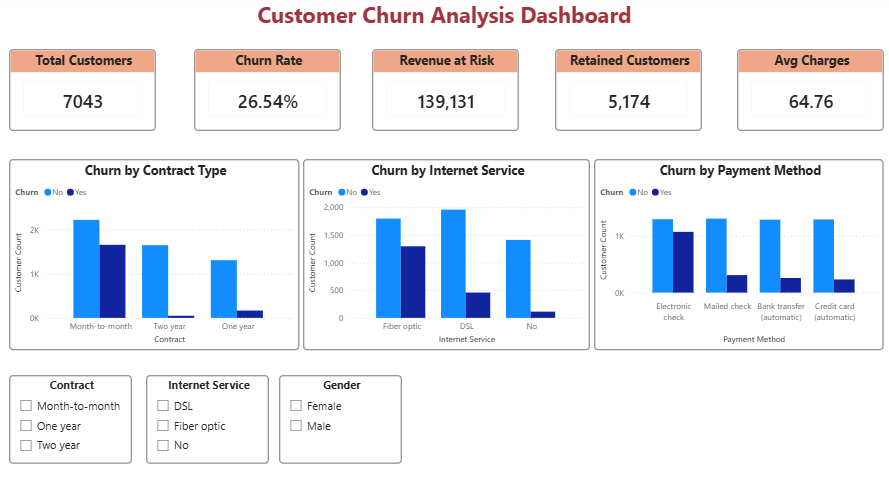
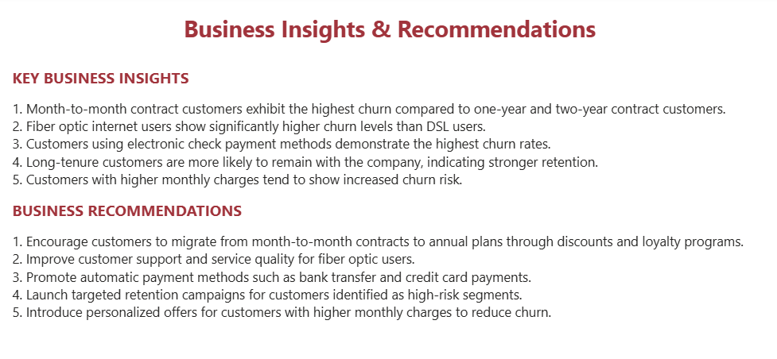

# 📊 Customer Churn Analysis & Prediction Dashboard

This project analyzes customer churn behavior using the IBM Telco Customer Churn dataset. The objective is to identify churn drivers, predict customer attrition using machine learning, and provide business insights through an interactive Power BI dashboard.

## 🛠️ Tech Stack
- Python
- Pandas
- NumPy
- Scikit-learn
- SQLite
- SQL
- Power BI
- Matplotlib
- Seaborn

## 📌 Project Objectives
- Analyze customer behavior and churn patterns
- Identify key factors influencing customer churn
- Build a machine learning model to predict churn
- Perform SQL-based KPI analysis
- Develop an interactive Power BI dashboard
- Generate actionable business recommendations

## 📂 Dataset Description
Dataset: IBM Telco Customer Churn Dataset

Dataset Features:
- Customer demographics
- Contract type
- Internet service
- Payment methods
- Monthly charges
- Customer tenure
- Churn status

Target Variable:
- Churn (Yes / No)

## 🧹 Data Preprocessing
- Converted TotalCharges to numeric format
- Handled missing values
- Removed duplicate records
- Encoded churn labels
- Applied one-hot encoding to categorical variables

## 🤖 Machine Learning Model

### Random Forest Classifier
- Ensemble-based classification model
- Handles non-linear relationships effectively
- Used to predict customer churn probability

## 🧪 Model Evaluation
- Accuracy, Precision, Recall, F1-Score, Confusion Matrix, Feature Importance Analysis

## 📈 Key Insights
- Month-to-month customers exhibited the highest churn rates
- Fiber optic users demonstrated significantly higher churn compared to DSL users
- Electronic check payment users showed increased churn risk
- Long-tenure customers were more likely to remain with the company
- Higher monthly charges were associated with increased churn

## 📊 Power BI Dashboard

### Churn Overview

### Business Insights & Recommendations

Dashboard Features:
- KPI Cards
- Churn Rate Analysis
- Revenue at Risk Tracking
- Customer Segmentation
- Interactive Slicers
- Business Recommendations

## 💡 Business Recommendations
- Encourage customers to switch to long-term contracts
- Improve support quality for fiber optic users
- Promote automatic payment methods
- Launch targeted retention campaigns for high-risk customers

## ▶️ How to Run
1. Clone the repository: git clone <repository-url>
2. Install dependencies: pip install -r requirements.txt
3. Run the Python analysis: python churn_project.py

## 🔮 Future Improvements
- Deploy churn prediction using Streamlit
- Integrate with a cloud database
- Implement automated ETL pipelines
- Add XGBoost and LightGBM models
- Build real-time customer retention monitoring

## 👩‍💻 Author
Farhanaaz J
